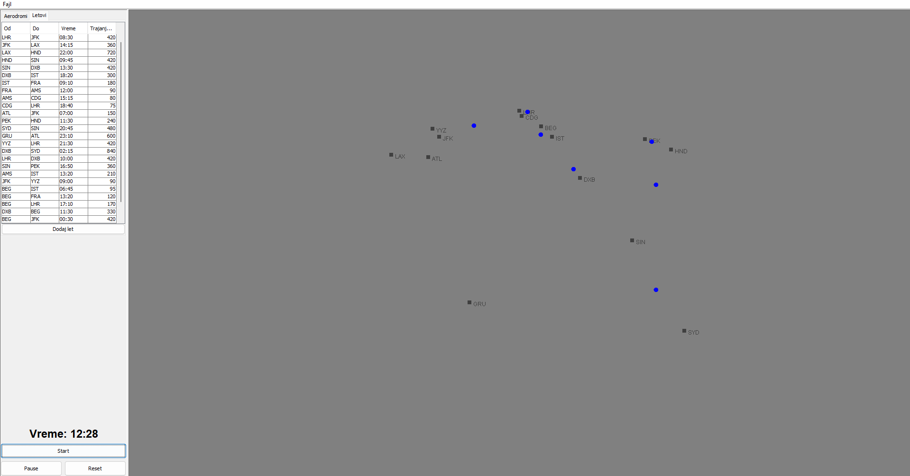

# Air Traffic Simulator

Java Swing application for managing and simulating airports and flights. The project supports importing/exporting data in CSV and JSON formats and provides a basic GUI for data manipulation and simulation management.

## Features

- Add, remove and display airports
- Add and manage flight routes
- Import data from CSV and JSON files
- Export data to CSV and JSON files
- Simple GUI-based workflow
- Simulate flights on an animated map



## Project structure

- `src/airtrafficsimulator/Main.java` — application entry point
- `src/airtrafficsimulator/gui/` — Swing interface classes
- `src/airtrafficsimulator/io/` — CSV/JSON import/export logic
- `src/airtrafficsimulator/logic/` — repository and simulation logic
- `src/airtrafficsimulator/model/` — airport, flight and position models

## Requirements

- Java 17+
- Maven

## Run the project

From the project root, run:

```powershell
mvn exec:java
```

> Note: the application GUI is in Serbian.
